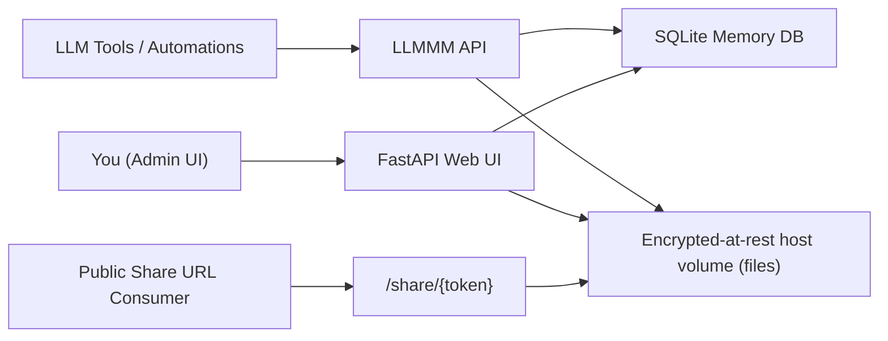

# LLMMM (Large Language Model Memory Manager)

LLMMM is a secure shared-memory and reference-file manager for multi-LLM workflows. It lets you store durable memories, retrieve curated context snapshots, and share supporting files (PDF, DOCX, TXT, Markdown) through expiring links.

It is designed for users who rotate between ChatGPT, Codex, Google Gemini, Claude, and NotebookLM.

## Core Capabilities

- Central memory database with tags, importance, pinned status, metadata, and source model.
- API key auth with per-key scopes (`read`, `write`, `files`, `admin`) and revocation.
- Pull profiles for periodic context retrieval (e.g., `default` profile at conversation start).
- Web admin UI for editing memories, managing keys, uploading files, and creating share links.
- File share links with expiry, optional password, and optional max-download cap.
- Docker-first deployment with persistent volume-backed data storage.
- Backup and restore scripts for operational safety.

## Architecture



## Tech Stack

- Backend: FastAPI + SQLAlchemy
- Storage: SQLite (`/app/data/llmmm.db`) + filesystem (`/app/data/files`)
- Auth:
  - Web UI: session cookie login
  - API: scoped API keys (hashed at rest)
- Deployment: Docker / Docker Compose

## Quick Start (Docker)

1. Copy environment template.

```bash
cp .env.example .env
```

2. Set strong secrets in `.env`.

- `LLMMM_ADMIN_PASSWORD`
- `LLMMM_ADMIN_PASSWORD_FORCE_RESET` (`true` once if you need to reset an existing admin password, then set back to `false`)
- `LLMMM_SESSION_SECRET`
- `LLMMM_SECRET_KEY`
- `LLMMM_BASE_EXTERNAL_URL` (public URL)
- `LLMMM_SESSION_HTTPS_ONLY` (`true` for HTTPS deployments, `false` for local HTTP testing)

3. Build and run.

```bash
docker compose up -d --build
```

4. Open the admin UI.

- `http://<server>:8080/login`
- Username: `admin`
- Password: `LLMMM_ADMIN_PASSWORD`

### Admin Login Troubleshooting

If you changed `LLMMM_ADMIN_PASSWORD` after first startup and login fails, your existing DB user still has the old hash.

1. Set `LLMMM_ADMIN_PASSWORD` to the new value.
2. Set `LLMMM_ADMIN_PASSWORD_FORCE_RESET=true`.
3. Restart with `docker compose up -d --build`.
4. Log in with the new password.
5. Set `LLMMM_ADMIN_PASSWORD_FORCE_RESET=false` and restart once more.

## Web UI Walkthrough

- `/` (Memories)
  - Create memory entries
  - Search/filter memories
  - Edit/delete memories
- `/keys`
  - Create/revoke scoped API keys
  - Copy key once at creation time
- `/files`
  - Upload reference files
  - Create/disable share links
  - Configure expiry, max downloads, password

## API Usage

### Create memory

```bash
curl -sS "$LLMMM_URL/api/v1/memories" \
  -H "X-API-Key: $LLMMM_API_KEY" \
  -H "Content-Type: application/json" \
  -d '{
    "title": "Preferred Writing Style",
    "body": "Use direct, concrete language. Avoid overlong intros.",
    "source_model": "chatgpt",
    "tags": ["style","writing"],
    "importance": 5,
    "pinned": true,
    "metadata": {"owner": "jon"}
  }'
```

### Pull periodic context snapshot

```bash
curl -sS "$LLMMM_URL/api/v1/context/pull?profile=default" \
  -H "X-API-Key: $LLMMM_API_KEY"
```

### Export memories

```bash
curl -sS "$LLMMM_URL/api/v1/memories/export?fmt=jsonl" \
  -H "X-API-Key: $LLMMM_API_KEY" > memories.jsonl
```

### Upload file + share link

```bash
curl -sS "$LLMMM_URL/api/v1/files/upload" \
  -H "X-API-Key: $LLMMM_API_KEY" \
  -F "file=@style-guide.pdf" \
  -F "description=Personal style guide"

curl -sS "$LLMMM_URL/api/v1/files/<file_id>/share-links" \
  -H "X-API-Key: $LLMMM_API_KEY" \
  -H "Content-Type: application/json" \
  -d '{"expires_in_hours":168,"max_downloads":20}'
```

## LLM Integration Patterns

Detailed guide: [`docs/integrations.md`](docs/integrations.md)

High-level pattern:

1. Give each tool its own API key.
2. Add a startup instruction in each tool to call `GET /api/v1/context/pull?profile=default`.
3. Add a capture workflow to call `POST /api/v1/memories` when a durable fact is learned.
4. Use expiring share links for reference files.

## CLI Helpers

- `scripts/llmmm_push.sh`
- `scripts/llmmm_pull.sh`
- `llmmm_push.sh` expects `jq` to be available on the host.

Examples:

```bash
./scripts/llmmm_push.sh "$LLMMM_URL" "$LLMMM_API_KEY" "Memory title" ./note.md "style,client-a" codex
./scripts/llmmm_pull.sh "$LLMMM_URL" "$LLMMM_API_KEY" default
```

## Backup and Restore

- Backup:

```bash
./scripts/backup.sh
```

- Restore:

```bash
./scripts/restore.sh ./data/backups/llmmm_backup_YYYYMMDD_HHMMSS.tar.gz --yes
```

See [`docs/operations.md`](docs/operations.md) for retention strategy and disaster recovery checks.

## Security Checklist (Internet-Exposed Deployment)

Full guide: [`docs/security.md`](docs/security.md)

- Put LLMMM behind HTTPS reverse proxy (Caddy, Nginx, Traefik).
- Use long random secrets and rotate periodically.
- Use separate API keys per LLM tool and revoke aggressively.
- Restrict CORS to trusted origins.
- Enable host firewall and fail2ban (or equivalent).
- Keep share links short-lived; add password for sensitive docs.
- Store `./data` on encrypted volume and back it up securely.

## Potential Pitfalls

See [`docs/pitfalls.md`](docs/pitfalls.md). Important examples:

- Prompt-injected or stale memories can poison future outputs.
- Over-sharing files via long-lived public links.
- Memory drift without expiration/review workflows.
- Key leakage from logs, screenshots, and pasted prompts.

## Development

### Run locally without Docker

```bash
python3 -m venv .venv
source .venv/bin/activate
pip install -r requirements.txt
uvicorn app.main:app --reload --port 8080
```

### Tests

```bash
pytest
```

## License

This repository is currently unlicensed. Add a license file before broader distribution.
